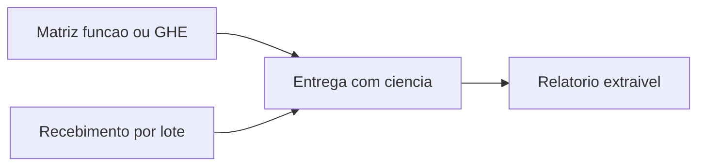

# Controle de EPI — plano para retomar

Sessão de 27 de setembro de 2026. Nada foi construído. Este arquivo é o combinado para começar o código.

Pasta do projeto: `/home/thiago/epi`. O Riffle não faz parte disso.

## O que é

Sistema desktop para uma indústria de planta fixa. A primeira versão prova o fornecimento de EPI exigido pela NR-6: quem recebeu o quê, com qual CA e lote, em que data, com ciência registrada.

No dia a dia, duas pessoas (SESMT e almoxarifado) usam o sistema para responder se cada trabalhador está com o EPI vigente da função. A prova de conceito roda em **um PC, um operador**, para validar rápido.

Orçamento, entrega e estoque foram o pedido original. Na primeira versão o estoque entra só como rastreio de lote (senão a ficha mente) e o orçamento fica de fora, com gancho no dado.

## Promessa para o cliente

Na fiscalização ou no processo, em minutos sai o relatório de fornecimento.

A ficha prova fornecimento. Não prova uso efetivo nem neutraliza insalubridade (Súmula 289 do TST). Aposentadoria especial e o evento S-2240 do eSocial exigem hierarquia de controle, CA na compra, troca na periodicidade, uso ao longo do tempo e higienização. A primeira versão não marca “EPI eficaz” e não gera eSocial.

## Legislação que o desenho obedece

Texto de referência: [NR-6 atualizada em 2025](https://www.gov.br/trabalho-e-emprego/pt-br/acesso-a-informacao/participacao-social/conselhos-e-orgaos-colegiados/comissao-tripartite-partitaria-permanente/normas-regulamentadora/normas-regulamentadoras-vigentes/nr-06-atualizada-2025.pdf) (Portaria MTE nº 57/2025). Base do fornecimento gratuito e do CA: CLT arts. 166 e 167.

A organização, no item 6.5.1, compra só EPI aprovado, orienta e treina, fornece de graça e em bom estado, registra o fornecimento, exige o uso, higieniza e mantém quando couber, troca na hora se danificar ou sumir, e comunica irregularidade ao órgão competente.

O registro pode ser livro, ficha ou sistema eletrônico, inclusive biométrico. Se for eletrônico, o item 6.5.1.1 exige extrair relatório. Esse relatório é o produto.

Dois relógios, e misturá-los invalida a prova:

- **CA na compra.** Item 6.9.2.1: CA válido para comercializar. Consulta pública: [CAEPI](https://caepi.mte.gov.br/).
- **Validade da peça na entrega.** Item 6.9.2.1.1: depois de comprado, valem armazenamento e o prazo do fabricante. CA vencido depois da compra é outro problema que luva vencida na prateleira.

Descartável e creme de proteção (6.5.1.2) podem ficar sem ficha individual, desde que haja quantidade no posto, na embalagem original — ou, sem ela, com identificação, fabricante, lote, validade e CA visíveis no local.

Na entrega, o item 6.7.2 pede informação ao trabalhador: descrição, risco coberto, limite da proteção, uso e ajuste, manutenção e substituição, limpeza e guarda. Treinamento completo (6.7.2.1) só quando o EPI exigir. Na primeira versão isso é um registro curto mais a flag “exige treinamento” e a data, sem virar LMS.

## Fluxo

- SESMT mantém a matriz função ou GHE por EPI: tipo do Anexo I, CA esperado, periodicidade, se exige treinamento, se é individual ou posto de disponibilização.
- Almoxarifado recebe a nota e grava fabricante, CA consultado na data, lote, validade da peça, tamanho e quantidade.
- Na admissão, na troca do prazo, no dano ou na mudança de função, separa-se o item da matriz no tamanho da pessoa.
- O trabalhador toma ciência no balcão. O sistema baixa aquele lote.
- Dano ou extravio gera troca imediata, com motivo.
- Desligamento gera pendência de devolução do que não é descartável.

## Primeira versão

- Cadastro do EPI ligado ao Anexo I, com fabricante e CA.
- Recebimento por lote: CA na data da compra, validade da peça, tamanho, saldo. Sem módulo de compra, forecast ou centro de custo.
- Matriz por função ou GHE, mais medidas da pessoa (bota, luva, vestimenta, respirador).
- Entrega com empregado, função na data, data e hora, descrição, CA, lote, quantidade, motivo e ciência.
- Dois modos: entrega individual e posto de disponibilização para descartável e creme.
- Bloqueios: não baixar lote vencido; não entregar item fora da matriz sem exceção registrada; alertar CA vencido no recebimento.
- Relatório por matrícula e período, exportável. É o item 6.5.1.1.
- Cobertura: para cada empregado ativo, o que a matriz exige e o que está vigente (entrega não estornada, não devolvida, dentro da validade e da periodicidade). É a tela do dia a dia.
- Registro curto da informação do item 6.7.2.
- Devolução e baixa por dano, extravio e desligamento.

## Fora, com gancho

- Orçamento, cotação e previsão de consumo. Cada lote já guarda custo unitário e cada entrega já guarda a função, para um centro de custo entrar depois sem reescrever a ficha.
- Biometria, app offline, contador de higienização, terceiros na planta, autoria de PGR e arquivo S-2240.
- Dois PCs gravando ao mesmo tempo. Ver distribuição.

## Acesso

Quem opera é SESMT, almoxarifado ou consulta. O trabalhador que recebe o EPI não tem login.

Papéis fixos, sem matriz de permissão:

- **Admin** — usuários, backup, parâmetros, e o que os outros fazem.
- **SESMT** — matriz, cadastro de EPI, exceção de entrega fora da matriz, leitura de tudo. Não apaga histórico.
- **Almoxarife** — recebimento de lote, entrega, devolução, saldo. Não mexe na matriz nem corrige entrega passada.
- **Consulta** — só relatórios.

Tabelas:

- `usuario` — nome, login, hash da senha, ativo.
- `papel` — semente dos quatro códigos.
- `usuario_papel` — um papel por usuário na tela; a tabela já admite mais de um.
- `auditoria` — append-only: instante, usuário, ação, entidade, id. Quem registrou a entrega é o usuário logado; o empregado da ficha é outra pessoa.

A entrega legal não se edita e não se apaga. Erro vira **estorno**, um registro novo que aponta o original. Trigger no SQLite recusa `UPDATE`/`DELETE` nas colunas da prova.

Criptografia:

- Senha com Argon2id (`spring-security-crypto`).
- Arquivo do banco com SQLCipher. Nome, matrícula e função são dado pessoal. A chave fica no cofre de credenciais do Windows, não no jar.
- CPF fica de fora se a matrícula bastar.
- Isso não é assinatura ICP-Brasil. Um admin da máquina ainda consegue chegar na chave. O desenho impede edição casual da ficha e leitura do arquivo solto.

O Spring Security de filtro HTTP, sessão e CSRF não entra. Não há request. A tela esconde o botão, e o serviço recusa a ação se o papel não permitir.

## Stack

- Java 25 e JavaFX 25.
- Spring Boot 4.1, sem servidor web (`spring.main.web-application-type=none`). O Spring entra pela transação: entrega e baixa do lote commitam juntas. JDBC explícito, sem JPA.
- SQLite em WAL, um arquivo, migrações Flyway.
- JasperReports para a ficha e o relatório por período. PDFBox fica para carimbo ou junção futura. Jasper é LGPL: distribuir o jar sem modificar a biblioteca cabe no instalador.
- JUnit 5 contra um SQLite temporário.
- Maven.

Spring Boot 3.5 saiu do suporte aberto em junho de 2026. A linha 4.1 declara Java 25.

## Distribuição

O cliente recebe um instalador `.exe` feito com `jpackage` (WiX) no Windows. Por dentro, um JRE 25 privado e os jars em `lib/`. O PC da planta não precisa ter Java.

Um fat jar único do Spring Boot briga com os nativos do JavaFX e ainda exige um JVM na máquina. O instalador é o artefato; a pasta `lib/` carrega as dependências.

- Binário em `Program Files`, substituído no upgrade.
- Banco em `%ProgramData%\Epi\`, nunca sobrescrito pelo instalador.
- Desenvolvimento no Linux com `mvn javafx:run`. O `.exe` não se gera daqui.

O JDBC fala com uma URL, e a tela só chama serviço. Se cada operador ganhar o próprio PC, troca-se o arquivo local por um Postgres na planta sem reescrever a ficha. Isso não se constrói agora. Dois processos gravando o mesmo SQLite em pasta de rede corrompem o arquivo.

## Quando for codar

1. Esqueleto Maven: Java 25, JavaFX 25, Spring Boot 4.1 sem web, Flyway, SQLite.
2. Login, papéis e auditoria, com a entrega já imutável no schema.
3. Matriz, recebimento por lote (CA na compra separado da validade da peça) e entrega nos dois modos.
4. Cobertura e relatório exportável.
5. Instalador por último, numa máquina Windows.

Definido para uso externo:
- marca: `Easy NR6`;
- produto: `Easy NR6 Gestao de EPI`;
- dominio: `easynr6.com.br`.

Ainda em aberto, e nao bloqueia o esqueleto: se as duas pessoas do dia a dia terao cada uma o seu PC depois da prova de conceito.
