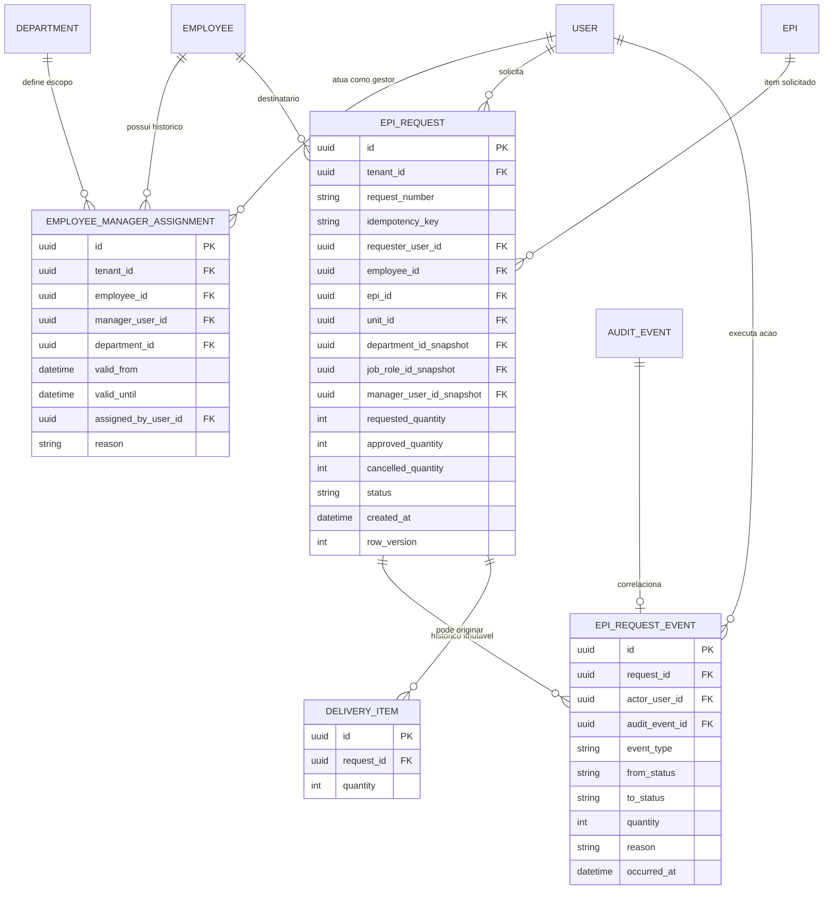
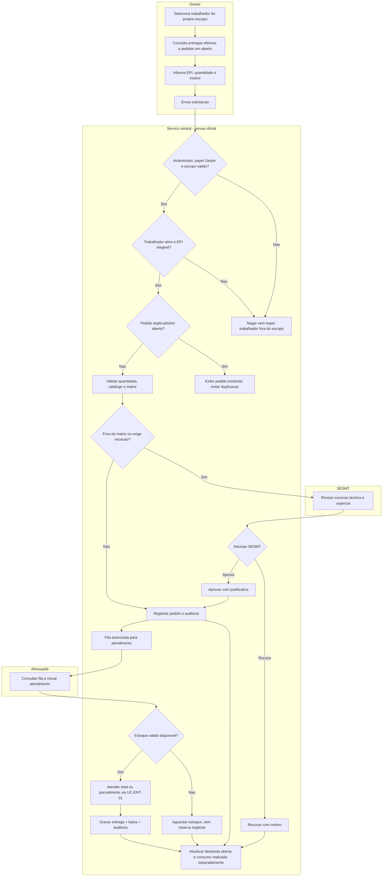

# Spec Curta - UC-SOL-01 Solicitar EPI para trabalhador

## Identificacao

- ID: `UC-SOL-01`
- Tipo: `UC`
- Iniciativa/Epico: `INI-01` / `EP-CORE`
- Responsavel: Time Easy NR6
- Status: refinamento inicial; dependencias e decisoes operacionais pendentes

## 1) Contexto

- Problema real:
  - trabalhadores podem nao ter acesso individual a um computador ou ao sistema; um gestor com acesso diario precisa solicitar EPI em nome de um trabalhador sob sua responsabilidade.
  - as solicitacoes ajudam a antecipar demanda, planejar reposicao e compras, sem confundir demanda com consumo efetivamente entregue.
- Ator principal: `Gestor`.
- Atores de apoio: `SESMT` (analise tecnica/excecao), `Almoxarife` (atendimento), `Admin` (governanca).
- Impacto se nao resolver:
  - demandas chegam por canais nao rastreaveis;
  - estoque e compras nao refletem pedidos pendentes;
  - gestor pode nao saber o historico recente de fornecimento do trabalhador.

## 2) Escopo

### No escopo

- disponibilizar ao papel `Gestor` uma area funcional restrita para solicitar EPI para trabalhador sob seu escopo;
- localizar trabalhador e identificar sua unidade, setor e gestor responsavel vigentes;
- selecionar EPI ativo e quantidade inteira positiva;
- consultar, para trabalhadores autorizados, um resumo do historico de entregas efetivamente registradas e solicitacoes ainda abertas;
- encaminhar solicitacao para analise tecnica quando o item nao estiver previsto na matriz de funcao/GHE;
- disponibilizar fila de solicitacoes para os perfis autorizados de analise e atendimento;
- permitir recusa com motivo, cancelamento dentro dos limites aprovados, espera por estoque e atendimento total/parcial;
- manter solicitacao, decisoes, cancelamentos e atendimentos auditaveis, com identidade do solicitante distinta do trabalhador destinatario;
- alimentar visoes de demanda/forecast separando pedidos de entregas realizadas;
- exigir que a versao oficial opere em arquitetura cliente-servidor centralizada.

### Fora de escopo

- trabalhador abrir solicitacao com login proprio;
- solicitacao baixar ou reservar estoque, confirmar entrega, substituir CAEPI ou servir como ciencia/aceite de recebimento;
- compra, cotacao, ordem de compra, aprovacao financeira ou previsao automatica de data de reposicao;
- substituicao automatica por EPI considerado equivalente;
- uso multiusuario da fila compartilhada no modo SQLite individual de demonstracao/freemium;
- consulta ampla de dados pessoais ou historico fora do escopo organizacional do gestor.

## 3) Premissas de produto e implantacao

1. **Modo demonstracao/freemium**: SQLite atende um tecnico/operador trabalhando sozinho em uma instalacao local. Nao e fila compartilhada nem modo oficial multiusuario; duas instalacoes nao compartilham pedidos.
2. **Modo oficial**: cliente-servidor, com dados centralizados em banco remoto on-premises ou cloud. A proposta arquitetural e cliente JavaFX -> servico central da aplicacao -> banco remoto; clientes desktop nao devem conectar diretamente ao banco central.
3. Permissoes, escopo do gestor, transicoes, auditoria e invariantes sao aplicados no servico central, nao somente escondidos na UI.
4. A disponibilidade da tela de solicitacao durante falha/atraso da importacao CAEPI deve respeitar o estado e as regras definidos em `UC-CAE-01`; a politica para novas solicitacoes usando o ultimo catalogo completo precisa ser aprovada.

## 4) Regras de negocio

1. O gestor so pode pesquisar trabalhadores que estejam no seu escopo de gestao vigente. A verificacao e obrigatoria no servico a cada consulta e mutacao, mesmo que a UI filtre os resultados.
2. A relacao trabalhador-gestor e setor/departamento deve ser mantida como dado organizacional rastreavel e com vigencia. A solicitacao preserva um snapshot de unidade, setor/departamento, funcao e gestor responsavel no instante do envio; mudancas futuras nao alteram o historico do pedido.
3. O solicitante, o trabalhador destinatario, quem analisa e quem atende sao papeis/identidades distintos, ainda que em algum caso uma pessoa tenha mais de um papel. Cada acao registra o usuario autenticado que a executou.
4. Uma solicitacao nao e entrega, reserva de estoque, autorizacao automatica, prova de fornecimento ou consumo realizado. Somente `UC-ENT-01` registra entrega, debita lote e grava evidencia de ciencia/aceite.
5. Quantidade deve ser inteira e maior que zero. Limites maximos por solicitacao e por periodo ainda precisam ser definidos.
6. Item nao previsto na matriz vigente da funcao/GHE exige analise e decisao do SESMT antes de seguir para atendimento. Situacoes urgentes devem ter caminho de escalonamento, sem concessao automatica pelo papel Gestor.
7. Falta de saldo valido nao converte a solicitacao em entrega, nao permite saldo negativo e nao cria reserva implicita. A solicitacao pode aguardar estoque e ser atendida parcialmente quando a regra operacional aprovada permitir.
8. Substituicao de EPI nao e automatica. Qualquer alternativa exige decisao explicita de perfil autorizado, verificacao de adequacao ao risco e CA aplicavel, e registro da decisao.
9. Solicitacoes duplicadas ou concorrentes do mesmo trabalhador/EPI devem ser detectadas e claramente apresentadas. O envio nao pode silenciosamente duplicar demanda; a regra final de idempotencia/confirmacao deve ser fechada no refinamento.
10. Transicoes de estado sao controladas e auditadas. Solicitacoes rejeitadas/canceladas permanecem no historico e nao contam como consumo realizado.
11. Historico de consumo exibe entregas efetivas, estornos e devolucoes de forma distinta. Solicitacoes pendentes/recusadas/canceladas nao podem aparecer como itens entregues.
12. Forecast deve segregar pelo menos:
    - demanda solicitada em aberto;
    - demanda aprovada ainda nao atendida;
    - quantidades parcialmente atendidas ainda pendentes;
    - quantidades efetivamente entregues (consumo realizado).
13. Pedidos rejeitados e cancelados nao contam como demanda em aberto nem consumo. Cancelamentos/estornos posteriores devem ajustar as visoes sem apagar eventos historicos.
14. Forecast apoia analise de demanda e planejamento de compra; nao equivale a ordem de compra nem promete disponibilidade ou prazo.
15. Acesso do Gestor limita-se as telas e dados necessarios para solicitar e acompanhar pedidos de seu escopo; nao concede acesso geral a cadastros mestres, estoque, entrega ou administracao.
16. App oficial exige identidade central, autorizacao por papel e escopo organizacional, concorrencia segura e auditoria centralizada. O SQLite individual nao pode ser compartilhado por pasta de rede.

## 5) Atores e permissoes propostas

| Ator | Acoes |
|---|---|
| `Gestor` | Consultar trabalhadores do proprio escopo, consultar resumo limitado de historico, criar pedido e acompanhar/cancelar pedido proprio conforme estado permitido |
| `SESMT` | Analisar pedidos fora da matriz, aprovar/recusar excecoes e consultar dados tecnicos necessarios |
| `Almoxarife` | Consultar fila autorizada, informar indisponibilidade/espera de estoque e atender total ou parcialmente por meio do fluxo formal de entrega |
| `Admin` | Governar usuarios, papeis e escopos; nao recebe aprovacao tecnica implicita por ser Admin |
| `Consulta` | Consultar somente relatorios/visoes explicitamente autorizados; nao solicitar, decidir ou atender pedidos |

O nome final do papel, se `GESTOR`, `SUPERVISOR` ou outro, e sua cardinalidade por usuario/unidade/setor continuam pendentes.

## 6) Fluxo principal

1. Gestor autenticado abre a area `Solicitacoes de EPI`.
2. Sistema identifica unidade e escopo de trabalhadores autorizado para o gestor.
3. Gestor seleciona trabalhador ativo sob seu escopo.
4. Sistema exibe setor, funcao e gestor vigentes, resumo de entregas efetivas recentes e pedidos em aberto, com estados claramente separados.
5. Gestor seleciona EPI ativo, informa quantidade e motivo/contexto da solicitacao.
6. Sistema valida escopo, status do trabalhador/EPI, quantidade, duplicidade e matriz vigente.
7. Se houver necessidade de analise tecnica, o sistema encaminha o pedido ao SESMT; caso contrario, disponibiliza-o na fila operacional.
8. Sistema grava solicitacao e auditoria em transacao consistente e apresenta identificador/estado ao solicitante.
9. Almoxarife autorizado consulta a fila e inicia atendimento usando o fluxo `UC-ENT-01`.
10. Entrega efetiva baixa estoque, registra CA/lote, evidencia do trabalhador e auditoria de entrega, vinculando o atendimento a solicitacao.
11. Sistema atualiza o estado do pedido e as visoes de demanda e consumo sem confundir pedido com entrega.

## 6.1) Modelagem logica de dados proposta

Esta e uma proposta logica independente do dialeto SQL. Os nomes finais, tipos fisicos e chaves de tenant/unidade devem ser adaptados nas migracoes SQLite do modo demo e PostgreSQL do modo oficial. A UI/client nao recebe permissao para gravar diretamente nessas tabelas no modo oficial.

### Relacao vigente trabalhador-gestor

Manter a relacao como atribuicao com historico, e nao apenas um `manager_id` sobrescrito em `employee`.

| Entidade/campo | Regra |
|---|---|
| `employee_manager_assignment.id` | Identificador da atribuicao |
| `tenant_id` | Organizacao proprietaria; explicita em banco compartilhado, podendo ser escopo da implantacao em banco dedicado |
| `employee_id` | Trabalhador subordinado |
| `manager_user_id` | Usuario com papel de gestor; deve referenciar identidade central no modo oficial |
| `unit_id`, `department_id` | Escopo organizacional da atribuicao |
| `valid_from`, `valid_until` | Periodo inclusivo/exclusivo, sem sobreposicao invalida para o mesmo trabalhador/escopo |
| `assigned_by_user_id`, `created_at`, `reason` | Rastreabilidade da designacao ou alteracao |

Somente atribuicoes vigentes autorizam pesquisa e envio de solicitacoes. A regra para multiplos gestores simultaneos, substitutos e delegacao continua pendente na secao 15.

### Solicitacao

Uma linha de `epi_request` representa **um EPI para um trabalhador**. Solicitar varios EPIs cria solicitacoes separadas, evitando ambiguidades de aprovacao, cancelamento e atendimento parcial. Um futuro carrinho pode agrupar solicitacoes, sem mudar a semantica de cada linha.

| Campo proposto em `epi_request` | Uso |
|---|---|
| `id` | UUID/identificador global da solicitacao |
| `tenant_id` | Cliente/organizacao proprietaria em implantacao compartilhada |
| `request_number` | Numero legivel unico por tenant/unidade |
| `idempotency_key` | Chave enviada pelo cliente para repeticoes de rede; unica no escopo definido |
| `requester_user_id` | Gestor que abriu o pedido; nunca confundir com destinatario |
| `employee_id` | Trabalhador destinatario |
| `unit_id`, `department_id`, `job_role_id`, `manager_user_id` | IDs organizacionais observados no envio |
| `unit_name_snapshot`, `department_name_snapshot`, `job_role_name_snapshot`, `manager_name_snapshot` | Rotulos imutaveis para leitura/auditoria historica |
| `epi_id`, `epi_description_snapshot` | Referencia ao cadastro e descricao no instante do envio |
| `requested_quantity` | Inteiro positivo solicitado |
| `approved_quantity` | Nula enquanto nao decidido/rejeitado; no MVP, aprovacao autoriza a quantidade total solicitada. Aprovar parcialmente fica fora ate decisao futura |
| `cancelled_quantity` | Quantidade remanescente cancelada; nao inclui quantidades ja entregues |
| `reason_code`, `request_note`, `urgency`, `needed_by` | Motivo/contexto; obrigatoriedade e dominios aguardam decisao |
| `caepi_snapshot_id` ou `catalog_version` | Versao da base de referencia usada na validacao, se a politica permitir enviar durante estado CAEPI degradado |
| `status` | Estado atual materializado; cada transicao tambem gera evento imutavel |
| `created_at`, `updated_at`, `row_version` | Datas e controle concorrente otimista |

`fulfilled_quantity` nao deve ser editavel na solicitacao: e derivada da soma das quantidades em `entrega_epi_item` vinculadas a ela. Enquanto `approved_quantity` nao for definido, o pedido nao pode ser atendido. No MVP, a decisao e aprovar a quantidade integral ou rejeitar o pedido integralmente; o atendimento pode ocorrer em varias entregas parciais. Se o restante aprovado for cancelado, entregas anteriores permanecem intactas.

### Eventos, aprovacoes e vinculo com entrega

| Entidade | Campos essenciais | Responsabilidade |
|---|---|---|
| `epi_request_event` | `id`, `request_id`, `event_type`, `from_status`, `to_status`, `actor_user_id`, `occurred_at`, `reason`, `quantity`, `idempotency_key`, `audit_event_id` | Historico append-only de envio, aprovacao, recusa, espera de estoque, atendimento, cancelamento e conflito relevante |
| `entrega_epi_item.request_id` | FK opcional para `epi_request` | Relaciona cada entrega formal ao pedido que a originou; varias entregas parciais podem apontar para o mesmo pedido |

O evento especifico da solicitacao e o evento geral de `auditoria` devem ser gravados na mesma transacao que altera seu estado. Para cada `epi_request_event` de negocio deve existir exatamente um evento geral de auditoria correlacionado. `UC-ENT-01` grava entrega, baixa de lote, ciencia/aceite, auditoria e referencia ao pedido atomicamente. Falha em qualquer parte nao pode deixar entrega sem correlacao ou pedido marcado como atendido sem entrega.

Tipos de evento propostos: `REQUEST_SUBMITTED`, `REQUEST_APPROVED`, `REQUEST_REJECTED`, `STOCK_WAITING`, `DELIVERY_LINKED`, `REMAINDER_CANCELLED` e `REQUEST_CANCELLED`. Repeticao idempotente que devolve o registro original nao cria um segundo evento de envio; tentativa negada e auditada conforme politica de seguranca, sem necessariamente criar evento de dominio.

### Consistencias e indices propostos

- Foreign keys para trabalhador, gestor/solicitante, EPI, unidade, setor/departamento, funcao e eventos de entrega.
- `requested_quantity > 0`; no MVP `approved_quantity IS NULL OR approved_quantity = requested_quantity`; `cancelled_quantity >= 0`.
- Para pedido aprovado: `fulfilled_quantity + cancelled_quantity <= approved_quantity`; atendimento completo exige igualdade. Para pedido ainda nao aprovado, `cancelled_quantity` e zero, exceto cancelamento integral, que encerra o pedido sem permitir entrega. Rejeicao encerra sem aprovacao ou consumo.
- `idempotency_key` unica por `(tenant_id, requester_user_id, idempotency_key)` e `request_number` unica por `(tenant_id, unit_id, request_number)`. Em banco dedicado, `tenant_id` pode ser implicito no deployment, mas nunca pode ser omitido da verificacao de autorizacao.
- Indices por `(tenant_id, unit_id, status, created_at)`, `(tenant_id, employee_id, created_at)`, `(tenant_id, requester_user_id, status, created_at)`, `(tenant_id, epi_id, status, created_at)` e eventos por `(request_id, occurred_at)`.
- Toda consulta de gestor filtra no servidor por atribuicao vigente e tenant/unidade; IDs fornecidos pela UI nao sao prova de autorizacao.
- Pedido guarda snapshot de escopo e rótulos, mas autorizacao usa a atribuicao vigente e a politica para pedidos historicos.
- A deteccao de duplicidade `(employee_id, epi_id)` depende de definir quais estados contam como abertos e a janela temporal; nao adicionar constraint unica permanente antes dessa decisao.
- Forecast e historico de consumo sao consultas/views sobre solicitacoes, eventos e entregas reais; nao duplicar as quantidades em tabela de agregados como fonte de verdade.

### Diagrama de entidades



`USER`, `AUDIT_EVENT`, `EPI` e `DELIVERY_ITEM` sao nomes logicos; mapear para as entidades/tabelas definitivas dos modulos de identidade, auditoria, EPI e entrega. A chave global dos registros do modo oficial deve ser compativel com o banco remoto; o modo SQLite individual pode usar a estrategia local equivalente.

## 6.2) Mock textual da tela do Gestor

```text
┌──────────────────────────────────────────────────────────────────────────────┐
│ Solicitacoes de EPI                        Unidade: [unidade autorizada v]   │
│ Nova solicitacao | Minhas solicitacoes                                      │
├──────────────────────────────────────────────────────────────────────────────┤
│ [Banner CAEPI: estado, ultima carga valida e orientacao quando degradado]   │
├──────────────────────────────────────┬───────────────────────────────────────┤
│ NOVA SOLICITACAO                      │ HISTORICO DE ENTREGAS EFETIVAS       │
│                                       │ Data | EPI | Qtd | CA | Situacao     │
│ Trabalhador (escopo do gestor)        │ ...                                  │
│ Buscar matricula/nome [________]      │                                      │
│                                       │ PEDIDOS EM ABERTO                    │
│ [Nome / matricula / setor / funcao]   │ # | EPI | Pedida | Atendida | Saldo │
│ Vinculo de gestao: [valido]           │   |     |         |          |Estado │
│                                       │                                      │
│ EPI:        [EPI ativo            v]  │ DETALHE DO PEDIDO SELECIONADO        │
│ Quantidade: [ 1 ]                     │ Identificador, estado, ator/data e   │
│ Motivo:     [Selecionar           v]  │ justificativas conforme permissao   │
│ Necessario ate: [dd/mm/aaaa]          │                                      │
│ Urgencia:   [Normal               v]  │ Linha do tempo baseada nos eventos   │
│ Observacao: [____________________]   │ reais, adaptada ao estado do pedido │
│                                       │                                      │
│ [Enviar solicitacao] [Limpar]         │                                      │
├──────────────────────────────────────┴───────────────────────────────────────┤
│ Solicitar nao e entregar: nao reserva estoque nem registra consumo.          │
└──────────────────────────────────────────────────────────────────────────────┘
```

### Componentes e comportamento visual propostos

- Cabecalho exibe apenas unidades autorizadas ao usuario; seletor de unidade so aparece quando houver mais de uma. Trocar unidade atualiza e revalida trabalhador, EPI e escopo no servico.
- Busca de trabalhador mostra somente pessoas do escopo vigente do gestor; nao deve revelar se uma pessoa fora do escopo existe.
- Cartao do trabalhador exibe apenas nome, matricula, setor/departamento, funcao e validade do vinculo de gestao necessarios para confirmar o destinatario.
- Historico de entregas efetivas e pedidos abertos sao blocos separados. Entregas podem mostrar data, EPI, quantidade, CA quando pertinente e estado de devolucao/estorno claramente distinguido.
- Tabela de pedidos abertos mostra quantidade solicitada, atendida e saldo restante, alem do estado. A quantidade atendida e derivada de entregas vinculadas, nao de edicao manual do pedido.
- Selecionar um pedido abre seu detalhe e uma linha do tempo derivada dos eventos reais. Nao usar uma sequencia fixa "solicitado-aprovado-atendimento-concluido": pedidos pendentes de analise, rejeitados, aguardando estoque, parciais e cancelados tem trajetorias diferentes.
- EPI fora da matriz mostra aviso de analise SESMT e encaminhamento. O pedido nunca aparece como aprovado antes da decisao registrada.
- Duplicidade mostra o pedido existente, seu estado e atalho para o detalhe. Nao deve ser apenas um alerta visual: a politica final decidira entre bloquear duplicacao ou permitir nova solicitacao com confirmacao; a verificacao autoritativa e no servico central.
- Falha/atraso CAEPI usa o estado de `UC-CAE-01`. Ate decidir se e permitido solicitar com a ultima carga, a tela nao pode simular catalogo atualizado nem afirmar elegibilidade vigente.
- A confirmacao informa numero do pedido e estado inicial, com mensagem clara: "Solicitacao registrada; isto nao e uma entrega nem reserva de estoque."
- O Gestor nao ve saldo por lote, custo, trabalhadores fora do escopo, cadastro mestre, botoes de entrega ou acoes de aprovacao.
- Erros de conectividade no modo oficial preservam o formulario. Reenvio usa a mesma chave idempotente para consultar/reutilizar o resultado anterior sem criar duplicatas.
- A tela de solicitacao pode ser conceitualmente demonstrada em HTML, mas a interface do produto segue JavaFX. O HTML `docs/sol-epi.html` e uma referencia visual/prototipo estatico, nao implementacao nem evidencia de integracao.

### Requisitos de conteudo ainda nao aprovados no prototipo

- O prototipo sugere motivo obrigatorio, urgencia, data necessaria e quantidade maxima 10. Esses campos/valores continuam sujeitos as decisoes da secao 15; nao inferir limite ou regra de urgencia pelo exemplo visual.
- "Alta (Risco Imediato)" precisa apontar para o caminho de escalonamento aprovado e nao pode atrasar a entrega emergencial exigida pela politica da empresa.
- O estado "Aprovado / Fila" nao deve ser o padrao implicito: cada pedido segue a regra de aprovacao aprovada, com analise SESMT quando requerida.
- Alertas de matriz, duplicidade e escopo exibidos na tela sao feedback; autorizacao e validacao devem ser repetidas no backend/servico, nunca confiadas ao cliente.
- Dados exibidos em tabelas/detalhes devem ser inseridos como texto/controlos tipados, nao concatenados em HTML executavel ou markup sem escape.

## 7) Estados e transicoes

Estados propostos:

- `PENDENTE_ANALISE`: aguarda decisao SESMT (ex.: fora da matriz);
- `APROVADA`: autorizada para atendimento;
- `AGUARDANDO_ESTOQUE`: sem saldo valido suficiente;
- `PARCIALMENTE_ATENDIDA`: parte da quantidade foi entregue, saldo solicitado permanece aberto;
- `ATENDIDA`: quantidade aprovada foi integralmente entregue;
- `REJEITADA`: encerrada por decisao autorizada com motivo;
- `CANCELADA`: cancelada por ator autorizado antes dos limites definidos.

Transicoes esperadas:

- envio -> `APROVADA` ou `PENDENTE_ANALISE`;
- `PENDENTE_ANALISE` -> `APROVADA` ou `REJEITADA`;
- `APROVADA` -> `AGUARDANDO_ESTOQUE`, `PARCIALMENTE_ATENDIDA`, `ATENDIDA` ou `CANCELADA`;
- `AGUARDANDO_ESTOQUE` -> `PARCIALMENTE_ATENDIDA`, `ATENDIDA` ou `CANCELADA`;
- `PARCIALMENTE_ATENDIDA` -> `AGUARDANDO_ESTOQUE`, `ATENDIDA` ou `CANCELADA` quanto ao saldo remanescente.

Cada mudanca registra ator, instante, estado anterior/novo, motivo/justificativa quando aplicavel e referencia a entrega associada. Nao e permitido reabrir silenciosamente pedido terminal; correcao deve criar novo evento ou solicitacao conforme politica a aprovar.

## 8) Fluxos alternativos e excecoes

- `SOL-001` Usuario nao autenticado ou sem papel Gestor: negar acesso a area.
- `SOL-002` Trabalhador fora do escopo do gestor: nao revelar o cadastro e negar a solicitacao.
- `SOL-003` Trabalhador inativo, transferido ou sem atribuicao organizacional vigente: bloquear ou encaminhar a revisao; nao presumir gestor/setor atual.
- `SOL-004` EPI inativo ou indisponivel no catalogo oficial confiavel: impedir envio ou aplicar a politica pendente de `UC-CAE-01`.
- `SOL-005` Quantidade nula, fracionaria, zero ou acima do limite aprovado: rejeitar com mensagem acionavel.
- `SOL-006` Pedido igual/em aberto para mesmo trabalhador e EPI: exibir o pedido existente; impedir duplicacao silenciosa.
- `SOL-007` EPI fora da matriz ou motivo de excecao: encaminhar ao SESMT; nao permitir que aprovacao do gestor substitua a tecnica.
- `SOL-008` Estoque insuficiente/vencido: manter pedido em espera ou permitir atendimento parcial conforme politica; nunca baixar saldo invalido.
- `SOL-009` Gestor tenta substituir EPI: negar; encaminhar a perfil autorizado para avaliacao documentada.
- `SOL-010` Gestor tenta solicitar para si mesmo: aplicar regra explicita de conflito/autoaprovacao, ainda pendente; nao permitir autoaprovacao de excecao.
- `SOL-011` Trabalhador muda de gestor/setor/unidade depois do envio: preservar snapshot e decidir encaminhamento operacional sem reescrever o solicitante ou os dados historicos.
- `SOL-012` Trabalhador e desligado/inativado enquanto pedido esta aberto: bloquear atendimento novo ou exigir decisao autorizada, preservando eventos existentes.
- `SOL-013` Duas pessoas atendem simultaneamente o mesmo pedido: controle concorrente/idempotente impede exceder quantidade solicitada ou saldo de estoque.
- `SOL-014` Cancelamento compete com atendimento em andamento: transicao atomica decide um unico resultado; nao pode haver pedido cancelado e entrega nao correlacionada.
- `SOL-015` Falha de rede/servidor ao enviar: cliente pode repetir com chave idempotente, sem criar pedidos duplicados; estado do resultado anterior deve ser consultavel.
- `SOL-016` Solicitacao urgente por dano, perda ou risco imediato: encaminhar para fluxo de prioridade definido; nao atrasar a entrega emergencial exigida pela politica da empresa, mantendo justificativa e auditoria.

## 9) Historico e forecast

### Historico exibido ao Gestor

- mostrar apenas trabalhadores do escopo autorizado;
- limitar campos a EPI, data, quantidade, CA quando pertinente, motivo e estado de estorno/devolucao;
- distinguir entrega efetiva de pedido e mostrar pedidos abertos separadamente;
- nao expor notas juridicas, dados pessoais ou evidencias de aceite alem do necessario para a tarefa;
- definir periodo, retencao visual e se gestores veem registros anteriores a sua designacao.

### Visao de demanda

- agrupar por periodo, unidade, setor/departamento, EPI e estado de demanda;
- apresentar quantidade pedida/aprovada/pendente e quantidade entregue em metricas separadas;
- incluir filtro/dimensao de funcao quando os dados organizacionais permitirem;
- excluir rejeitados/cancelados da demanda aberta, sem apagar sua trilha;
- evitar dupla contagem entre solicitacao parcialmente atendida e entrega: mostrar quantidade original, quantidade atendida e saldo pendente;
- nao apresentar uma projecao estatistica como forecast confiavel antes de definir janela temporal, sazonalidade e tratamento de pedidos atrasados.

## 10) Auditoria e seguranca

Auditar ao menos:

- criacao/envio e cancelamento de solicitacao;
- aprovacao/recusa e justificativa;
- alteracao de prioridade/estado de estoque;
- cada entrega parcial/final vinculada ao pedido;
- tentativas negadas por papel/escopo e conflitos relevantes de concorrencia.

Campos minimos: ator autenticado, papel/escopo aplicado, trabalhador destinatario, unidade/setor snapshot, EPI, quantidade solicitada/atendida, acao, estado anterior/novo, instante, justificativa e IDs de solicitacao/entrega relacionados.

Aplicar minimizacao de dados e segregacao por unidade/escopo. O resumo de historico nao deve ser uma forma indireta de acesso a todos os empregados ou de monitoramento sem finalidade. Definir autorizacao, retencao e auditoria de consulta antes de disponibilizar dados de consumo a gestores.

## 11) Criterios de aceite

- `CA-SOL-01`: Gestor autenticado acessa somente a area de solicitacao e trabalhadores de seu escopo.
- `CA-SOL-02`: cadastro do trabalhador permite identificar setor/departamento e gestor responsavel vigente, com historico suficiente para preservar a autoria/escopo de pedidos passados.
- `CA-SOL-03`: pedido registra solicitante distinto do destinatario, EPI, quantidade positiva, motivo e snapshots organizacionais.
- `CA-SOL-04`: sistema detecta pedido duplicado/em aberto e nao cria duplicacao silenciosa.
- `CA-SOL-05`: solicitacao fora da matriz exige decisao SESMT; gestor nao aprova a propria excecao.
- `CA-SOL-06`: solicitacao nao baixa/reserva estoque, nao cria entrega nem constitui evidencia de recebimento.
- `CA-SOL-07`: atendimento total/parcial usa `UC-ENT-01`, respeita saldo, validade, CA e aceite, e fica vinculado ao pedido.
- `CA-SOL-08`: mudanca de estado exige permissao, transicao valida, auditoria e justificativa quando aplicavel.
- `CA-SOL-09`: historico distingue solicitacoes de entregas, devolucoes e estornos e respeita o escopo do gestor.
- `CA-SOL-10`: visao de demanda separa quantidade solicitada, aprovada pendente e entregue; pedidos cancelados/rejeitados nao viram consumo.
- `CA-SOL-11`: concorrencia, repeticao de requisicao, cancelamento concorrente e atendimento parcial nao excedem pedido nem saldo.
- `CA-SOL-12`: modo oficial utiliza servico central e banco remoto compartilhado; modo SQLite demo nao promete fila multiusuario/sincronizada.
- `CA-SOL-13`: relacao gestor-trabalhador tem vigencia; pedido persiste snapshots organizacionais, eventos append-only e entrega relacionada sem dupla contagem.
- `CA-SOL-14`: tela apresenta formulario, historico e pedidos em aberto separados, limitando campos/acoes ao escopo do Gestor.

## 12) Catalogo inicial de erros

| Codigo | Condicao | Resultado |
|---|---|---|
| `SOL-001` | Papel/identidade sem permissao para solicitar | Negar acesso |
| `SOL-002` | Trabalhador fora do escopo do gestor | Negar sem revelar dados do trabalhador |
| `SOL-003` | Trabalhador inativo ou sem vinculo organizacional vigente | Bloquear ou exigir revisao autorizada |
| `SOL-004` | EPI inativo ou catalogo CAEPI sem estado confiavel | Bloquear envio conforme politica vigente |
| `SOL-005` | Quantidade invalida | Rejeitar validacao |
| `SOL-006` | Pedido duplicado/em aberto | Retornar pedido existente ou exigir confirmacao explicita |
| `SOL-007` | Exige excecao tecnica fora da matriz | Encaminhar ao SESMT |
| `SOL-008` | Saldo valido indisponivel | Aguardar estoque ou atendimento parcial autorizado |
| `SOL-009` | Transicao de estado/permissao invalida | Negar e auditar |
| `SOL-010` | Conflito concorrente de atendimento/cancelamento | Recarregar estado sem duplicar entrega |
| `SOL-011` | Resultado de envio incerto por falha de rede | Consultar pelo ID idempotente antes de repetir |

## 13) Cenarios de teste

Plano pre-codigo e matriz de cenarios: `docs/03-operacao/matriz-testes-uc-sol-01.md`. O documento define as camadas de validacao, invariantes e gates; nenhum teste foi escrito ou executado. Os cenarios dependentes das decisoes da secao 15 nao podem receber resultado esperado definitivo ate essas regras serem aprovadas.

## 14) Dependencias e recorte tecnico

- M1 de cadastro organizacional: trabalhador, unidade, setor/departamento, funcao e gestor responsavel.
- `UC-ENT-01` implementada para atendimento transacional e entrega legal; `UC-LOT-01/02` para saldo/lote.
- `UC-MAT-01/02` para matriz e periodicidade, especialmente para analise de excecao e historico.
- identidade central e escopo RBAC no modo oficial cliente-servidor.
- repositório/servico de solicitacoes com transicoes e auditoria atomicas, controle otimista/idempotencia e vinculo aos eventos de entrega.
- estado confiavel do catalogo conforme `UC-CAE-01`.
- visao de demanda separada de consumo efetivo para planejamento de compra.

## 15) Decisoes pendentes antes do DoR

1. Nome definitivo do papel (`Gestor`, `Supervisor`) e se um usuario pode ter multiplos papeis.
2. Escopo do gestor: unidade, setor, equipe explicita, arvore hierarquica, multiplos gestores, substitutos e delegacao temporaria.
3. Vigencia/historico de gestor-setor-funcao-unidade no cadastro do trabalhador e tratamento de transferencias.
4. Gestor pode solicitar para si? Quem decide pedidos do proprio gestor?
5. Campos obrigatorios: motivo, urgencia, data necessaria, observacao; unidades permitidas e limite de quantidade.
6. Idempotencia e politica de duplicidade (mesmo EPI/trabalhador; janela temporal; coexistencia de pedidos).
7. Matriz: sempre exigir analise SESMT fora da matriz? Regra para emergencia, dano ou extravio.
8. Estoque: quando permitir parcial, quem autoriza, como fica o saldo aberto e quando expira/escalona.
9. Quem pode recusar/cancelar e ate qual ponto o solicitante pode cancelar.
10. Se mudanca de setor/gestor/unidade ou desligamento transfere, bloqueia ou encerra pedidos abertos.
11. Historico: quais periodos e campos o gestor pode ver, e como apresentar estorno/devolucao sem excesso de dados pessoais.
12. Forecast: janela, agregacao, custo, lead time, estacionalidade e tratamento de pedidos pendentes, rejeitados e cancelados.
13. Estado CAEPI desatualizado: permitir solicitacao com base na ultima carga completa ou bloquear ate atualizacao diaria.
14. Topologia do servico central (API/backend) e implantacao on-premises/cloud, autenticacao, conectividade e disponibilidade.
15. Escopo do produto SQLite demo/freemium: desabilitar solicitacao multiusuario, permitir somente uso local individual, ou simular fluxo sem fila compartilhada.
16. Armazenar snapshots de identificadores e nomes somente no pedido, ou tambem versionar historico completo de funcao/setor/unidade do trabalhador; a proposta captura snapshots no pedido e mantem vigencia formal para atribuicao de gestor.
17. Confirmar que aprovacao no MVP e integral ou rejeicao integral, mantendo parcialidade apenas no atendimento; decidir se aprovacao parcial sera necessaria.

## 16) Criterio de saida do refinamento

- regras de escopo do gestor e snapshot organizacional aprovadas;
- transicoes, aprovacoes, duplicidade, cancelamento e atendimento parcial definidos;
- politica de historico/privacidade e metricas de forecast aprovada;
- dependencias de estoque, matriz, entrega e cliente-servidor implementadas ou planejadas;
- matriz de testes aprovada e DoR liberado antes de iniciar codigo.

## 17) Diagrama Mermaid do fluxo


